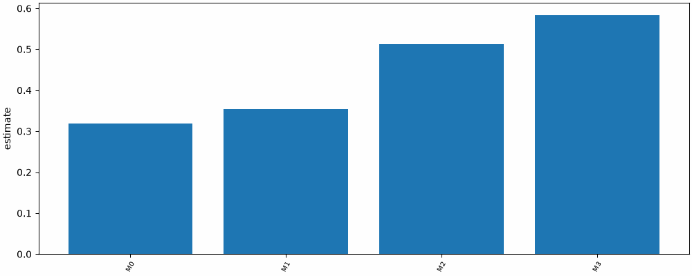
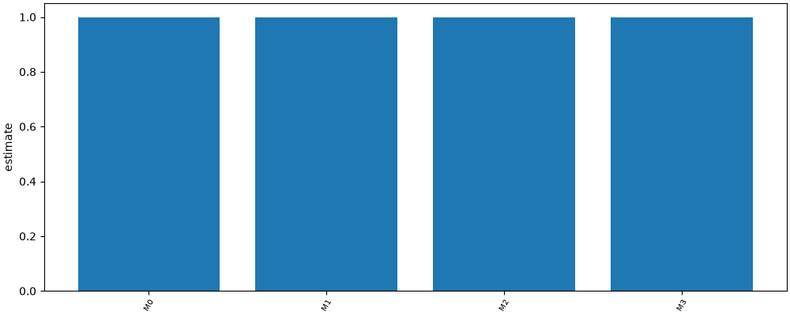
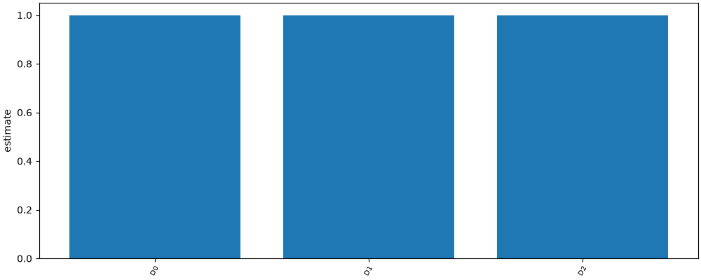
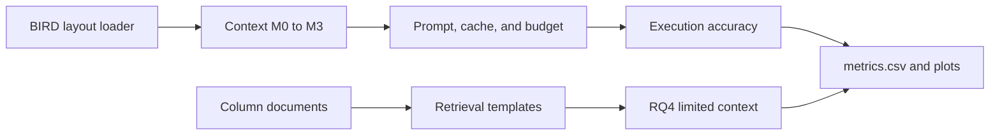

# Metadata Matters — Quantify how catalog metadata changes text-to-SQL accuracy

[](.github/workflows/ci.yml)
[](LICENSE)

## Demo



TODO: `docs/demo.gif` is a placeholder until a person records it. The headline charts from the fixture runs are execution accuracy by metadata level and decoy usage by condition.





## Why

Text-to-SQL benchmarks score models on bare schemas, while people working from a data catalog choose tables using descriptions, sample values, business hints, and labels such as certified or deprecated. This repository measures whether that metadata changes execution accuracy and schema retrieval, including whether governance labels keep a model off plausible but wrong decoy tables. It is for catalog teams and researchers who need that comparison to be reproducible and testable offline.

## Quickstart

```bash
uv run mm run rq1 -c configs/rq1.yaml --fixture
```

That command uses the included `tiny_library` fixture and the gold-SQL stub. It does not download BIRD and it does not call a hosted model. Install [uv](https://docs.astral.sh/uv/) first if it is not already on the machine.

## How it works



`mm run` loads examples through the BIRD layout, builds one context level or a retrieved column subset, asks the configured chat model for SQL, and scores execution accuracy as an order-insensitive set of rows. RQ2 scores the same SQL against a decoy copy of the database. RQ3 ranks column documents. Each run writes `run.json` before the metrics tables and plots.

## Results

<!-- results:start -->
| RQ | Run | Headline |
|---|---|---|
| rq1 | `20260930T184730Z-128297c4` | `M0` 1.000 |
| rq2 | `20260930T184732Z-40dda842` | `D0` 1.000 |
| rq3 | `20260930T184735Z-f664f7e2` | `t0 sentence-transformers/all-MiniLM-L6-v2 global question` 0.639 |
| rq4 | `20260930T184738Z-4b99c9f1` | `full-m2` 1.000 |

Full tables are in each run's `metrics.csv` and `report.md`.
<!-- results:end -->

The fixture runs and the draft write-up are in [docs/findings.md](docs/findings.md).

## Design decisions

- [0001 — BIRD-layout loader](docs/adr/0001-bird-layout-loader.md)
- [0002 — Provisional config defaults](docs/adr/0002-provisional-config-defaults.md)
- [0003 — Budget estimate and McNemar](docs/adr/0003-budget-estimate-and-mcnemar.md)

## Roadmap

- A 500-question BIRD dev sample with the hosted models named in `configs/models.yaml`, after `budget.max_usd` is set above zero and `uv run mm download` has fetched the dev set.
- Confirm the BIRD licence before publishing any result that uses that data.
- Additional benchmarks, including Spider 2.0.

## Licence

Apache-2.0. The BIRD dev set is not included. `uv run mm download` fetches it into `data/bird/`, which is gitignored. Confirm BIRD's licence at <https://bird-bench.github.io/> before publishing results that use it. Token prices in `configs/prices.yaml` are maintained by hand and must be checked before a paid run.
