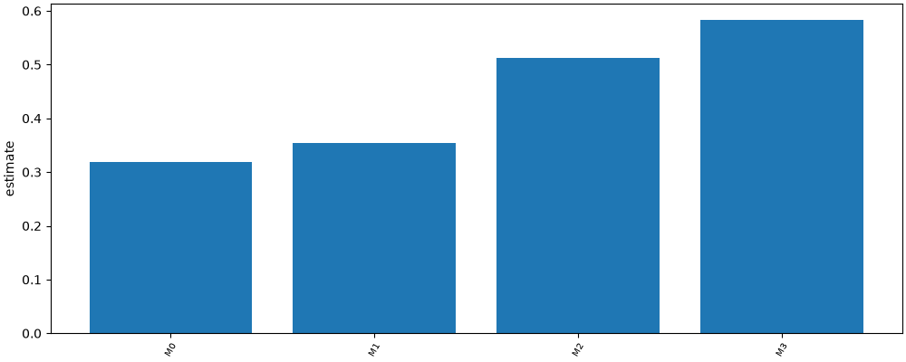

# RQ1 execution accuracy

## Method

Fixture run with stub models. Numbers below are read from metrics.csv.

## Results

| label | condition | estimate | low | high | n |
| --- | --- | --- | --- | --- | --- |
| M0 | M0 | 0.318 | 0.28 | 0.362 | 500 |
| M1 | M1 | 0.354 | 0.31795 | 0.396 | 500 |
| M2 | M2 | 0.512 | 0.472 | 0.552 | 500 |
| M3 | M3 | 0.584 | 0.544 | 0.626 | 500 |

## Plots

## Caveats

- M3 adds the example's own BIRD evidence, labelled as a business glossary hint. That hint is question-specific, not a property of the table.
