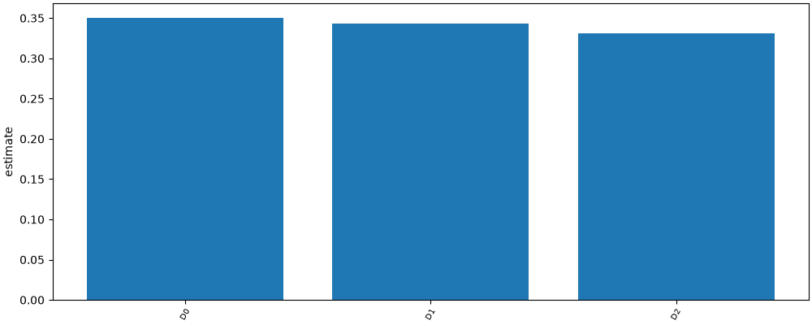

# RQ2 decoys

## Method

Fixture run with stub models. Numbers below are read from metrics.csv.

## Results

| label | condition | estimate | low | high | n | metric |
| --- | --- | --- | --- | --- | --- | --- |
| D0 | D0 | 0.35070140280561124 | 0.3106212424849699 | 0.39478957915831664 | 499 | ex |
| D1 | D1 | 0.342685370741483 | 0.3046092184368738 | 0.38481963927855706 | 499 | ex |
| D2 | D2 | 0.3306613226452906 | 0.2905811623246493 | 0.3707915831663326 | 499 | ex |
| D0 | D0 | 0.004008016032064128 | 0.0 | 0.01002004008016032 | 499 | decoy_usage |
| D1 | D1 | 0.0 | 0.0 | 0.0 | 499 | decoy_usage |
| D2 | D2 | 0.002004008016032064 | 0.0 | 0.006012024048096192 | 499 | decoy_usage |

## Plots

## Caveats

- Decoy tables exist only on copies. Checksums are in decoys.json.
- 1 examples skipped: gold SQL named no local table.
