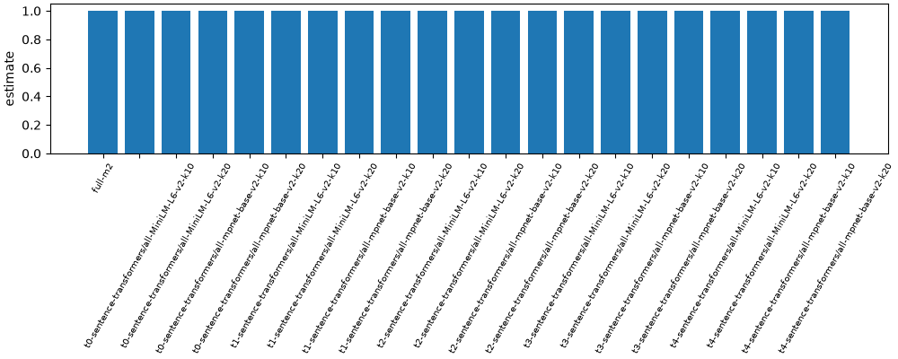

# RQ4 retrieved schema

## Method

Fixture run with stub models. Numbers below are read from metrics.csv.

## Results

| label | condition | estimate | low | high | n |
| --- | --- | --- | --- | --- | --- |
| full-m2 | full-m2 | 1.0 | 1.0 | 1.0 | 12 |
| t0-sentence-transformers/all-MiniLM-L6-v2-k10 | t0-sentence-transformers/all-MiniLM-L6-v2-k10 | 1.0 | 1.0 | 1.0 | 12 |
| t0-sentence-transformers/all-MiniLM-L6-v2-k20 | t0-sentence-transformers/all-MiniLM-L6-v2-k20 | 1.0 | 1.0 | 1.0 | 12 |
| t0-sentence-transformers/all-mpnet-base-v2-k10 | t0-sentence-transformers/all-mpnet-base-v2-k10 | 1.0 | 1.0 | 1.0 | 12 |
| t0-sentence-transformers/all-mpnet-base-v2-k20 | t0-sentence-transformers/all-mpnet-base-v2-k20 | 1.0 | 1.0 | 1.0 | 12 |
| t1-sentence-transformers/all-MiniLM-L6-v2-k10 | t1-sentence-transformers/all-MiniLM-L6-v2-k10 | 1.0 | 1.0 | 1.0 | 12 |
| t1-sentence-transformers/all-MiniLM-L6-v2-k20 | t1-sentence-transformers/all-MiniLM-L6-v2-k20 | 1.0 | 1.0 | 1.0 | 12 |
| t1-sentence-transformers/all-mpnet-base-v2-k10 | t1-sentence-transformers/all-mpnet-base-v2-k10 | 1.0 | 1.0 | 1.0 | 12 |
| t1-sentence-transformers/all-mpnet-base-v2-k20 | t1-sentence-transformers/all-mpnet-base-v2-k20 | 1.0 | 1.0 | 1.0 | 12 |
| t2-sentence-transformers/all-MiniLM-L6-v2-k10 | t2-sentence-transformers/all-MiniLM-L6-v2-k10 | 1.0 | 1.0 | 1.0 | 12 |
| t2-sentence-transformers/all-MiniLM-L6-v2-k20 | t2-sentence-transformers/all-MiniLM-L6-v2-k20 | 1.0 | 1.0 | 1.0 | 12 |
| t2-sentence-transformers/all-mpnet-base-v2-k10 | t2-sentence-transformers/all-mpnet-base-v2-k10 | 1.0 | 1.0 | 1.0 | 12 |
| t2-sentence-transformers/all-mpnet-base-v2-k20 | t2-sentence-transformers/all-mpnet-base-v2-k20 | 1.0 | 1.0 | 1.0 | 12 |
| t3-sentence-transformers/all-MiniLM-L6-v2-k10 | t3-sentence-transformers/all-MiniLM-L6-v2-k10 | 1.0 | 1.0 | 1.0 | 12 |
| t3-sentence-transformers/all-MiniLM-L6-v2-k20 | t3-sentence-transformers/all-MiniLM-L6-v2-k20 | 1.0 | 1.0 | 1.0 | 12 |
| t3-sentence-transformers/all-mpnet-base-v2-k10 | t3-sentence-transformers/all-mpnet-base-v2-k10 | 1.0 | 1.0 | 1.0 | 12 |
| t3-sentence-transformers/all-mpnet-base-v2-k20 | t3-sentence-transformers/all-mpnet-base-v2-k20 | 1.0 | 1.0 | 1.0 | 12 |
| t4-sentence-transformers/all-MiniLM-L6-v2-k10 | t4-sentence-transformers/all-MiniLM-L6-v2-k10 | 1.0 | 1.0 | 1.0 | 12 |
| t4-sentence-transformers/all-MiniLM-L6-v2-k20 | t4-sentence-transformers/all-MiniLM-L6-v2-k20 | 1.0 | 1.0 | 1.0 | 12 |
| t4-sentence-transformers/all-mpnet-base-v2-k10 | t4-sentence-transformers/all-mpnet-base-v2-k10 | 1.0 | 1.0 | 1.0 | 12 |
| t4-sentence-transformers/all-mpnet-base-v2-k20 | t4-sentence-transformers/all-mpnet-base-v2-k20 | 1.0 | 1.0 | 1.0 | 12 |

## Plots

## Caveats

- The full-schema M2 row is the upper reference for the retrieved-column prompts.
